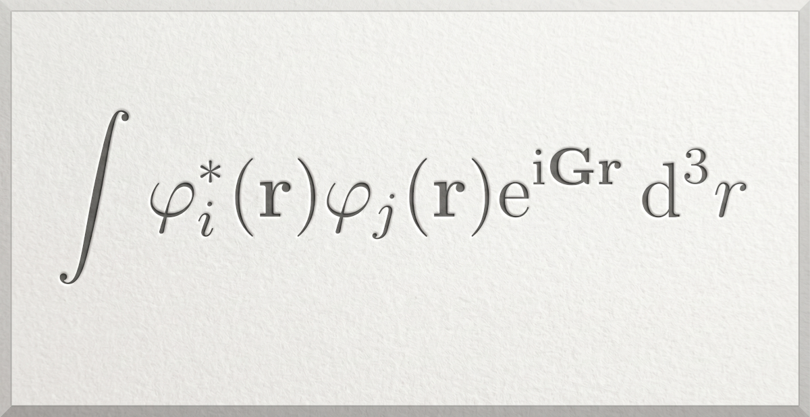

We implemented exact exchange in the periodic and plane wave based DFTK code.

{fig-align="center" width="30%"}

This exact exchange (EXX) implementation enables Hartree-Fock and hybrid functional calculation (PBE0, HSE) for periodic systems and comes with the following features:

* spin-restricted and unrestricted EXX
* Adaptively Compressed Exchange (ACE)
* restriction to $\mathbf \Gamma$-point sampling of the Brillouine zone
* various techniques to treat the Coulomb singularity at $G+q=0$:
  * [Probe charge Ewald](https://docs.dftk.org/stable/api/#DFTK.ProbeCharge)
  * [Wigner-Seitz truncation](https://docs.dftk.org/stable/api/#DFTK.WignerSeitzTruncatedCoulomb)
  * [Spherical truncation](https://docs.dftk.org/stable/api/#DFTK.SphericallyTruncatedCoulomb)
  * [Voxel averaging](https://docs.dftk.org/stable/api/#DFTK.VoxelAveraged)

Check the [example file](https://github.com/JuliaMolSim/DFTK.jl/blob/master/examples/exact_exchange.jl) in DFTK.